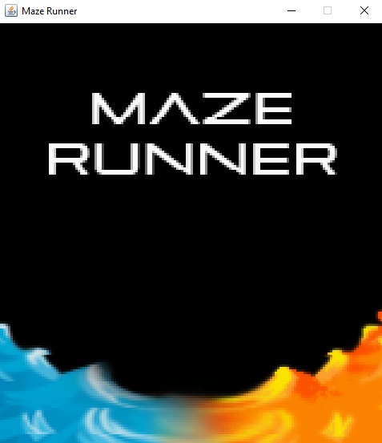
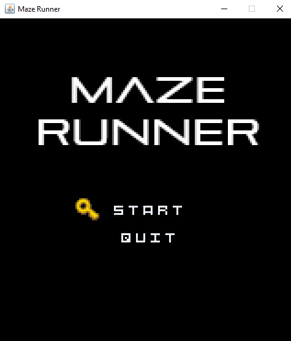
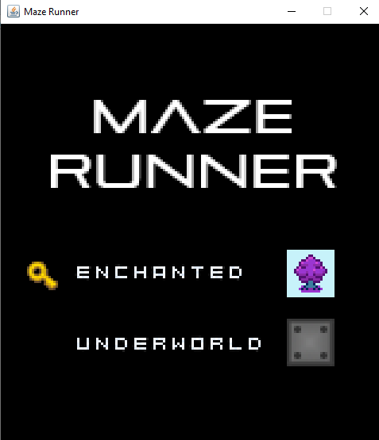
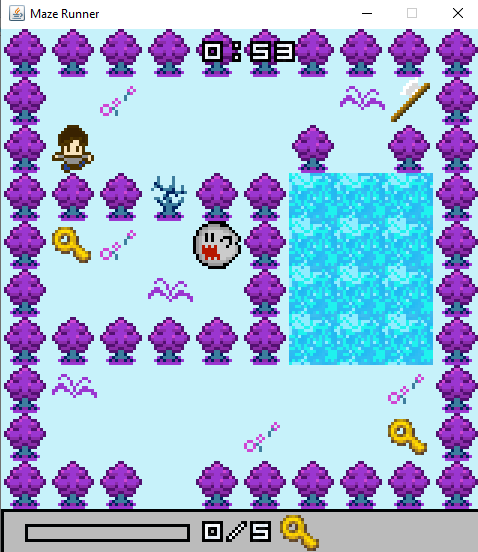
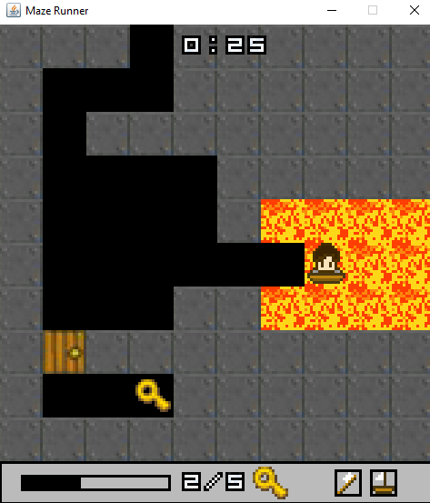

# The Maze Runner - A 2D Tilemap Based Game 

A 2D tilemap based game inspired by the Maze Runner movie implemented in Java.

**Game Description:**
 The goal of the game is to escape the maze your player is trapped in by collecting all the keys, fighting off the grievers and kicking down the doors before the timer runs out. 

**Game UI:**

Menu

          

Maze Worlds

     

